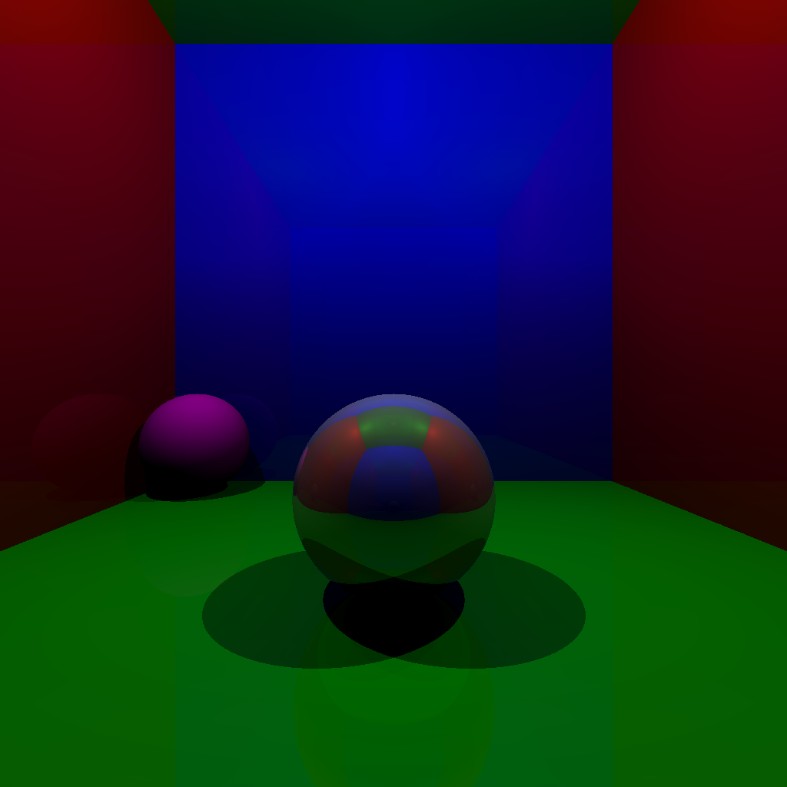
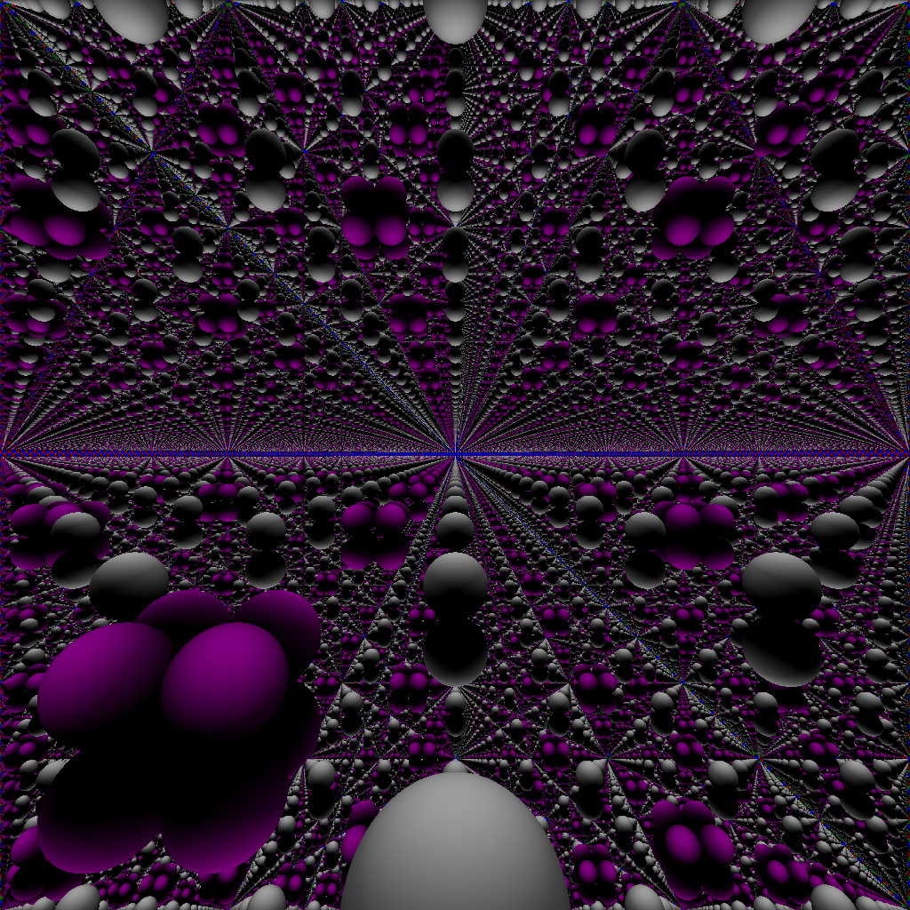

# C++ Ray Tracer

## Example Images

| Description | Image |
| --- | --- |
| The default image generated when running right now |  |
| Odd things may happen if everything's a mirror |  |

## TODO

- [ ] Dynamic scene loading
- [ ] Make light physically present and rendered
- [ ] Anti-aliasing
- [ ] Ray-disk intersections
- [ ] Polygon rendering
- [ ] .obj loading
- [ ] Transparency